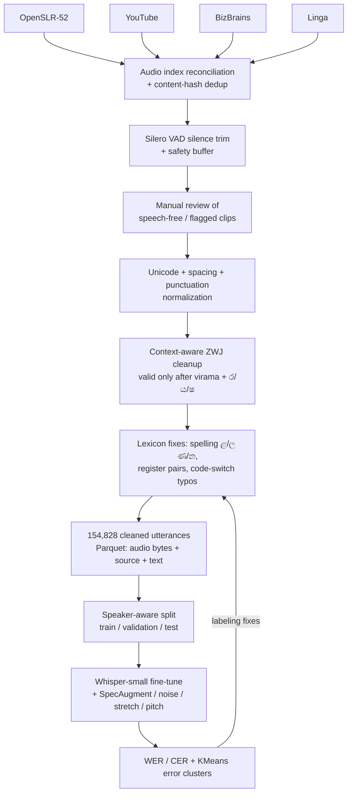
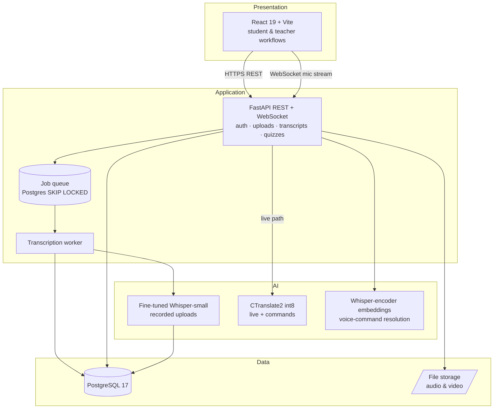

# SinhaSpeech

**Sinhala Speech Recognition and Accessibility Application**

SinhaSpeech is an accessible education platform for Sinhala-speaking students and teachers. It turns
Sinhala speech into clear, editable text, and turns a student's own speech into written work. It
serves two groups who are poorly served by typed interfaces: **Deaf and hard-of-hearing students**,
who need the lecturer's speech as readable text, and **students with writing or motor difficulties**,
who answer and take notes by speaking.

The project has two halves developed as one traceable system:

- **Model development** - a reproducible Sinhala ASR pipeline that cleans four public corpora into
  154,828 training-ready utterances and fine-tunes `openai/whisper-small`. The best run reaches
  **16.38% WER / 4.43% CER** on a speaker-disjoint test set.
- **The application** - a React + FastAPI + PostgreSQL web app for lecture captioning, live captions,
  spoken quizzes and notes, transcript review/export, hands-free voice commands, and teacher review.

**Model:** [`SinhaSpeech/whisper-small-sinhala-v6-e6-run11-best`](https://huggingface.co/SinhaSpeech/whisper-small-sinhala-v6-e6-run11-best)
&nbsp;·&nbsp; **Dataset:** [`SinhaSpeech/sinhala-asr-data`](https://huggingface.co/datasets/SinhaSpeech/sinhala-asr-data)

Built for **IN22-S5-CS3501 Data Science and Engineering Project**, Department of Computer Science and
Engineering, University of Moratuwa - **Group 12**.

---

## Table of contents

1. [Part 1 - Model development](#part-1--model-development)
   - [Data sources](#data-sources)
   - [Preprocessing pipeline](#preprocessing-pipeline)
   - [Dataset versions](#dataset-versions)
   - [Fine-tuning runs](#fine-tuning-runs)
   - [Error analysis](#error-analysis)
   - [Model artifacts](#model-artifacts)
2. [Part 2 - The application](#part-2--the-application)
   - [Architecture](#architecture)
   - [Features](#features)
   - [Voice command mode](#voice-command-mode)
3. [Repository layout](#repository-layout)
4. [Getting started (clone & run)](#getting-started-clone--run)
   - [Prerequisites](#prerequisites)
   - [1. Clone](#1-clone)
   - [2. Backend](#2-backend-api--worker)
   - [3. Frontend](#3-frontend)
   - [4. Running with the real model](#4-running-with-the-real-sinhala-model)
   - [Docker Compose](#docker-compose)
5. [Testing](#testing)
6. [Deployment](#deployment)
7. [Known limitations](#known-limitations)
8. [Documentation index](#documentation-index)
9. [Team](#team)

---

# Part 1 - Model development

The recognizer is a **full fine-tune of `openai/whisper-small`** (multilingual encoder-decoder,
244M parameters) specialised for Sinhala lecture speech, including the Sinhala-English code-mixing
common in Sri Lankan classrooms.

## Data sources

Four public sources were combined. OpenSLR contributes the bulk; the others broaden domain and
code-mixing coverage.

| Source | Rows (cleaned) | Role |
|---|---|---|
| **OpenSLR-52** (Large Sinhala ASR) | 149,926 | Primary corpus |
| **YouTube Sinhala ASR** | } | |
| **BizBrains Academy** | } 4,902 combined | Domain / code-mixing diversity |
| **Linga** | } | |
| **Total** | **154,828** | |

## Preprocessing pipeline

Each source is cleaned end-to-end before training. Conflicts in external corrections are **logged,
not guessed**, and every exclusion is traceable.



Key steps:

1. **Deduplication** - content hashing dropped clips that appeared under two source labels
   (~67% of the pre-dedup collection rows were byte-for-byte OpenSLR duplicates).
2. **Voice-activity trimming** - Silero VAD trims leading/trailing silence with a safety buffer;
   clips flagged speech-free are reviewed by hand before removal.
3. **Transcript normalization** - Unicode, spacing, punctuation, and **context-dependent
   zero-width joiners** (a ZWJ is valid only immediately after a virama `්` and before ර/ය/ෂ).
4. **Lexicon canonicalization** (v6) - ~2,954 word instances fixed across letter-level spelling,
   ZWJ/rakaransaya conjuncts, register pairs, and confirmed code-switched English typos (see
   [`asr-lexicon-tools/`](asr-lexicon-tools/)).
5. **Augmentation** during training - SpecAugment-style masking plus additive noise
   (p=0.2, SNR 20-30 dB), time-stretch (p=0.2, 0.9-1.1×) and pitch-shift (p=0.2, ±2 semitones).

## Dataset versions

The corpus evolved across versions as error analysis exposed label defects. Two split
configurations exist: **`stratified`** (primary, 80/10/10, representative mix of all sources) and
**`held_out`** (cross-domain diagnostic - the test set is carved only from the smaller collection
domains, with OpenSLR excluded from training). See
[`model-development/data/finalDataset.md`](model-development/data/finalDataset.md).

| Version | Change |
|---|---|
| v1 | First cleaned pool |
| v4 | Spacing normalization + **speaker-disjoint** re-split |
| v5 | Register + word-boundary normalization |
| v6 | Lexicon canonicalization (spelling / ZWJ / register / typos) |

## Fine-tuning runs

Eleven runs plus one control compared full fine-tuning against LoRA across hyperparameters and
dataset versions, logged to Weights & Biases and tracked in
[`final-scripts/finetune_tracker.csv`](final-scripts/finetune_tracker.csv).

| Run / data | Method & setting | Test WER | Test CER |
|---|---|---|---|
| run1 / v1 | Full; 3e-5 linear; bs 32; 4 ep | 17.08% | 3.49% |
| run6-lora / v1 | LoRA r32; 5e-5; bs 64; 4 ep | 21.01% | 5.73% |
| run3-lora / v1 | LoRA r32 (wide targets); 1e-4 cosine; 4 ep | 25.99% | 7.06% |
| control / v2 | Full; 1e-5 cosine; bs 64; 4 ep | 28.47% | 7.93% |
| run5 / v4 | Full; 3e-5 linear; bs 64; 4 ep | 19.06% | 4.90% |
| run6-v5 / v5 | Full; 3e-5 linear; bs 64; 5 ep | 17.15% | 4.62% |
| run7-v5 / v5 | Full; 3e-5 **cosine**; bs 64; 5 ep | 17.44% | 4.72% |
| run8-v5 / v5 | Full; 3e-5 linear; bs 64; **4 ep** | 17.90% | 4.76% |
| run10-v6 / v6 | Full; 3e-5 linear; bs 64; 5 ep | 17.17% | 4.71% |
| **run11-v6 / v6 (best)** | **Full; 3e-5 linear; bs 64; 6 ep** | **16.38%** | **4.43%** |

> **Note:** WER is only comparable **within the same test split** (v1 differs from v4+, which are speaker-disjoint).

**Best model - `run11`.** Recipe: full fine-tune, LR **3e-5** linear, effective batch **64**, 500
warmup steps, **6 epochs** on v6. Findings from the ablations: full fine-tuning beat LoRA in every
matched comparison; linear beat cosine by 0.29 pts; the v6 lexicon cleanup alone was a statistical
tie with v5 (run10 ≈ run6-v5) - the gain to 16.38% came from the **extra 6th epoch**, not the
cleanup. See [`final-scripts/finetuneGuide.md`](final-scripts/finetuneGuide.md).

## Error analysis

Wrong utterances were clustered with character n-gram TF-IDF + KMeans. The headline finding:
after the speaker-disjoint re-split, headline WER rose (17.36% → 19.06%) **while the targeted error
class - spacing/word-boundary-only disagreements - collapsed ~84%**. Because the two numbers are on
different test sets this is not a regression; it showed that label conventions, not just more
training, were the lever. Later residual errors are dominated by honorific register, rare names and
abbreviations. Full write-up: [`ErrorAnalysis/Analysis.md`](ErrorAnalysis/Analysis.md).

## Model artifacts

| Artifact | Size | Used by |
|---|---|---|
| HF-format checkpoint (`.safetensors`) | ~925 MB | Recorded-upload worker (`from_pretrained`) |
| CTranslate2 int8 export (`model.bin`) | ~238 MB | Live/streaming WebSocket path (`faster-whisper`) |

- **Hugging Face model:** https://huggingface.co/SinhaSpeech/whisper-small-sinhala-v6-e6-run11-best
- **Hugging Face dataset:** https://huggingface.co/datasets/SinhaSpeech/sinhala-asr-data

Known trade-off: full fine-tunes lose most English ability (LibriSpeech WER 4.27% → 80.86% for run1);
lower-LR / LoRA configs preserved far more.

---

# Part 2 - The application

## Architecture

A four-layer architecture separates presentation, application, AI, and data. Recorded uploads go
through an asynchronous **job queue + worker**; live captioning and voice commands use a **WebSocket**
path with a smaller int8 model.



Recorded-upload sequence: the browser uploads media + title → API stores the file, creates a media
row and a **queued** job → a worker claims the oldest job (`FOR UPDATE SKIP LOCKED`), decodes it, and
commits all transcript segments + completion in **one transaction** → the browser polls status and
opens the draft for review/export. A failed decode yields a failed job, never a partial transcript.

## Features

**For everyone**
- **Sinhala speech-to-text** powering every transcript (16.38% WER model).
- **Role-based sign-in** (student / teacher) with JWT; role-aware dashboard.
- **Lecture captioning** - upload audio/video, queued transcription with progress & retry states.
- **Transcript editor** - segment-by-segment review, low-confidence word highlighting (adjustable
  threshold), smart search-and-replace, synced audio playback, word/duration/reading-time stats.
- **Export** - TXT, DOCX, PDF.
- **Transcript library** - searchable, filter by type/status, open/export/delete.
- **Accessibility** - English/Sinhala UI, three text sizes, high-contrast mode, keyboard-only
  sign-in, skip-to-content, ARIA labelling, axe (WCAG A/AA) checks in E2E tests.

**For students**
- **Self-study notes** - record/upload a voice note → editable transcript, or live transcription.
- **Spoken quiz answers** - answer published quizzes by speaking; review before submitting.
- **Voice command mode** - hands-free navigation and editing (see below).

**For teachers**
- **Quiz authoring** - create, draft, publish speech quizzes.
- **Submission review** - inspect spoken answers, enter marks and feedback.

Full matrix with demo scenes: [`docs/FEATURES.md`](docs/FEATURES.md).

## Voice command mode

Students can control parts of the app by voice (not whole-app voice control - a fixed command
vocabulary in the transcript-review and quiz flows). The wake word `zimi` arms a short command
window; a command is then resolved from a **Whisper-encoder speaker embedding** compared to the student's enrolled
samples (Manhattan similarity), with an **English audio classifier** (openWakeWord) for MCQ option
words. Destructive commands (`submit`, `delete`) require higher confidence and open a confirmation.
Full design: [`docs/COMMAND_MODE.md`](docs/COMMAND_MODE.md) and
[`docs/voice-enrollment.md`](docs/voice-enrollment.md).

---

## Repository layout

| Path | Contents |
|---|---|
| [`backend/`](backend/) | FastAPI + PostgreSQL API, job worker, streaming, voice commands. [`backend/README.md`](backend/README.md) |
| [`frontend/`](frontend/) | React 19 + Vite app. [`frontend/README.md`](frontend/README.md) |
| [`model-development/`](model-development/) | Data sources, preprocessing notebooks, dataset docs. |
| [`final-scripts/`](final-scripts/) | Fine-tuning, evaluation, run tracker, fine-tune guide. |
| [`ErrorAnalysis/`](ErrorAnalysis/) | Clustering error analysis + normalization approach. |
| [`asr-lexicon-tools/`](asr-lexicon-tools/) | Spelling / ZWJ / register consistency fixers. |
| [`openWake/`](openWake/) | English command audio classifier (openWakeWord). |
| [`docs/`](docs/) | Deployment, testing, command-mode, voice-enrollment docs. |
| [`test/`, `scripts/`](test/) | Backend, deployment, failover and load tests. |
| `docker-compose*.yml`, `Caddyfile.example` | Local Postgres + production deployment. |

---

## Getting started (clone & run)

> **What ships in the repo:** all source, tests, migrations, and the openWake command models.
> **What does NOT:** the large ASR model weights (`/models/` is gitignored) and `.env`. The app runs
> in **fake-transcriber mode** out of the box (great for development and the full UI); real speech
> recognition needs the model download in [step 4](#4-running-with-the-real-sinhala-model).

### Prerequisites

- **Python 3.11+**
- **Node.js 20.19+** (or 22.12+) and npm
- **PostgreSQL 17** (or Docker to run it)
- **FFmpeg** (required for real transcription and voice enrollment)
- ~2 GB disk + RAM headroom if you load the real model

### 1. Clone

```bash
git clone https://github.com/tharu-jwd/dse-project.git
cd dse-project
```

### 2. Backend (API + worker)

Run from the repository root unless a command says `cd backend`.

```bash
# a. Environment file (root .env configures the backend + Docker Compose)
cp .env.example .env          # PowerShell: Copy-Item .env.example .env
#   edit .env: set JWT_SECRET_KEY and the POSTGRES_* values.
#   keep TRANSCRIBER_BACKEND=fake for the fast path (no model download).

# b. Start PostgreSQL (or use your own)
docker compose up -d database

# c. Python environment + dependencies
python -m venv .venv
source .venv/bin/activate      # PowerShell: .\.venv\Scripts\Activate.ps1
pip install -r backend/requirements.txt

# d. Migrate the database and (optionally) seed demo data
cd backend
alembic upgrade head
python -m scripts.seed_users
python -m scripts.seed_transcripts

# e. Run the API (from backend/)
uvicorn app.main:app --reload
#   API:  http://localhost:8000
#   Docs: http://localhost:8000/docs

# f. In a SECOND terminal, run the worker (from backend/) - uploads stay
#    queued until a worker completes them.
cd backend && source ../.venv/bin/activate
python -m scripts.run_transcription_worker
#   add --once to process a single job and exit.
```

### 3. Frontend

```bash
cd frontend
cp .env.example .env
npm install
npm run dev          # prints http://localhost:5173
```

**Mock mode is on by default** and needs no backend. Demo accounts:

| Role | Email | Password |
|---|---|---|
| Student | `student@sinhaspeech.lk` | `demo123` |
| Teacher | `teacher@sinhaspeech.lk` | `demo123` |

In mock mode, upload a file with `fail` in its name (e.g. `lecture-fail.mp3`) to demo the
failed-transcription/retry state. To use the real backend, finish step 2, run the worker, and set
`VITE_USE_MOCK_API=false` in `frontend/.env`.

Frontend scripts: `npm run dev` · `npm run lint` · `npm test` · `npm run build` · `npm run preview`.

### 4. Running with the real Sinhala model

The default `TRANSCRIBER_BACKEND=fake` returns canned text. To do real recognition (the required
tools, `huggingface_hub[cli]` and `ctranslate2`, are already in `backend/requirements.txt`):

```bash
# Download the fine-tuned model into models/
huggingface-cli download SinhaSpeech/whisper-small-sinhala-v6-e6-run11-best \
  --local-dir models/whisper-sinhala1

# Build the int8 CTranslate2 export used by the live/streaming + command path
ct2-transformers-converter --model models/whisper-sinhala1 \
  --output_dir models/whisper-sinhala1-ct2 --quantization int8
```

Then set these in the root `.env` (see `.env.example` for the full block):

```ini
# Recorded-upload worker loads the HF-format model
TRANSCRIBER_BACKEND=whisper
WHISPER_MODEL=models/whisper-sinhala1
WHISPER_LANGUAGE=si

# Live WebSocket captioning + voice commands load the CT2 build
STREAMING_ENABLED=true
STREAMING_SOURCE_MODEL=models/whisper-sinhala1
STREAMING_MODEL_PATH=models/whisper-sinhala1-ct2
```

Restart the API and worker. (Alternatively, `TRANSCRIBER_BACKEND=speak_asr` with
`WHISPER_BASE_MODEL` + `WHISPER_ADAPTER_MODEL` loads a LoRA adapter straight from the Hub.)

Voice-command embedding matching additionally needs each student to **enroll** samples - see
[`docs/voice-enrollment.md`](docs/voice-enrollment.md).

### Docker Compose

```bash
docker compose up -d database          # just Postgres for local dev
docker compose -f docker-compose.prod.yml up -d   # full prod stack (mounts ./models read-only)
```

---

## Testing

```bash
# Backend (from repo root) - spins up against your Postgres
pytest -q
pytest -q --cov=app --cov-report=term      # with coverage (CI floor: 75%)

# Frontend
cd frontend && npm test                     # unit + accessibility (axe)
npm run lint

# End-to-end (Playwright) and deployment/failover - see test/ and scripts/
```

CI runs on every push to `main` and every PR ([`.github/workflows/ci.yml`](.github/workflows/ci.yml)):
backend tests (throwaway Postgres), frontend lint/build/tests, and a gitleaks secret scan. CI never
downloads the model - the transcriber is faked in tests. Coverage and the full plan are in
[`docs/TESTING_REPORT.md`](docs/TESTING_REPORT.md).

---

## Deployment

Production runs the backend + Postgres via Docker Compose behind **Caddy** on an **AWS EC2** instance,
with the **React frontend on Vercel**. The `./models` directory is mounted read-only into the backend
container. See [`docs/DEPLOYMENT.md`](docs/DEPLOYMENT.md),
[`docs/EC2_TEST_RUNBOOK.md`](docs/EC2_TEST_RUNBOOK.md), and `Caddyfile.example`.

---

## Known limitations

- **Live inference is CPU-bound.** On the deployed 2-vCPU instance, median speech-to-command latency
  was ~5.6 s for a single user and some commands timed out; concurrent live captioning is unproven at
  classroom scale. A GPU service / smaller model / controlled concurrency is future work.
- **English command classifier** was trained on TTS and tested on one real speaker; there is no
  Sinhala audio classifier yet.
- **Residual ASR errors** are dominated by honorific register, rare names, and abbreviations.
- **Collection-corpus QA is ongoing** - OpenSLR QA is complete; part of 268 flagged collection rows
  is still under manual review.

---

## Documentation index

| Doc | Topic |
|---|---|
| [`backend/README.md`](backend/README.md) | Backend setup, config, API reference |
| [`frontend/README.md`](frontend/README.md) | Frontend setup, routes, demo accounts |
| [`final-scripts/finetuneGuide.md`](final-scripts/finetuneGuide.md) | Fine-tuning & evaluation guide |
| [`model-development/data/finalDataset.md`](model-development/data/finalDataset.md) | Dataset build & splits |
| [`ErrorAnalysis/Analysis.md`](ErrorAnalysis/Analysis.md) | Error clustering & corrections |
| [`docs/COMMAND_MODE.md`](docs/COMMAND_MODE.md) | Voice command mode design |
| [`docs/voice-enrollment.md`](docs/voice-enrollment.md) | Voice sample enrollment |
| [`docs/FEATURES.md`](docs/FEATURES.md) | Full feature matrix |
| [`docs/DEPLOYMENT.md`](docs/DEPLOYMENT.md) · [`DEVOPS.md`](DEVOPS.md) | Deployment & ops |
| [`docs/TESTING_REPORT.md`](docs/TESTING_REPORT.md) | Test plan & results |

---

## Team

**Group 12 · Project 13** - University of Moratuwa

- 230283A - Yohan Jayasinghe
- 230295L - Tharupahan Jayawardana
- 230277J - Imindu Jayasekara

Mentor: Dr. Buddhika Karunarathna · Teaching Assistant: Mr. Ilampoornan
