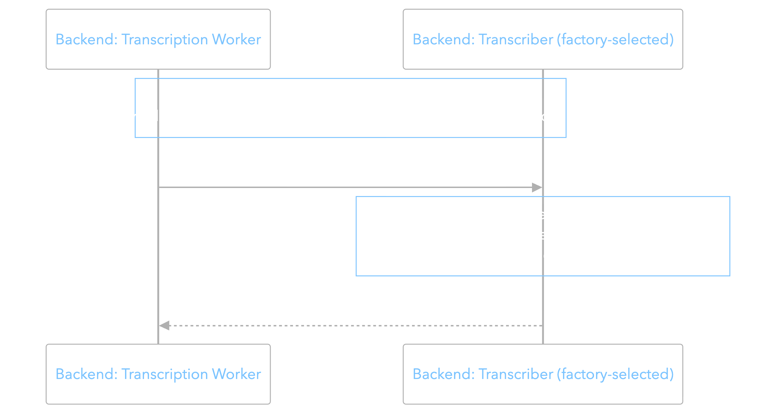
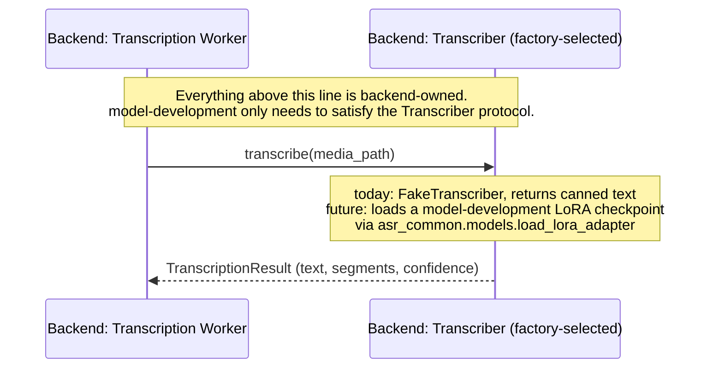

# How this folder connects to the rest of the system

This folder owns fine-tuning and evaluation only, and has exactly two coupling points with code
it doesn't own: the backend, downstream, where a checkpoint eventually gets used, and
preprocessing, upstream, where training data eventually comes from. Everything else in the
project (frontend, the rest of the backend, the database schema) is out of scope here; see
[`project-docs/Software Architecture.pdf`](../project-docs/Software%20Architecture.pdf) for the full system.

## Backend: the Transcriber protocol

`backend/app/transcribers/base.py` defines a `Transcriber` protocol with one method:

```python
class Transcriber(Protocol):
    def transcribe(self, media_path: Path) -> TranscriptionResult:
        ...
```

`TranscriptionResult` holds `text` and a list of segments (`start`, `end`, `text`, `confidence`,
word-level detail). `backend/app/transcribers/factory.py` currently only builds a
`FakeTranscriber`, selected via `settings.transcriber_backend`, which returns canned text. There
is no code path yet that loads a real model.

<p align="center">
  <br>
  
  <br>
  <br>
</p>

<details>
<summary>Mermaid source</summary>



</details>

A checkpoint from `train_asr.py` is a plain PEFT adapter directory, so a future real
implementation just needs to load it with `asr_common.models.load_lora_adapter` (or equivalent),
run inference on the given media path, and shape the output as a `TranscriptionResult`. Nothing
about that requires changes to this folder's code. Building that implementation and wiring it
into `factory.py` is future work, not done yet, and not this folder's job either.

## Preprocessing: the dev_dataset seam

`asr_common/dev_dataset.py` is the only place in this workflow that knows anything about where
training data comes from. See the "Placeholder dataset" section of
[`README.md`](README.md) for what it does today and what changes when the real preprocessing
pipeline is ready.

## What's not connected yet

- No real `Transcriber` implementation exists. The backend always uses `FakeTranscriber` today.
- The preprocessing pipeline's real output format isn't finalized, so this folder trains against
  a placeholder public dataset instead.
