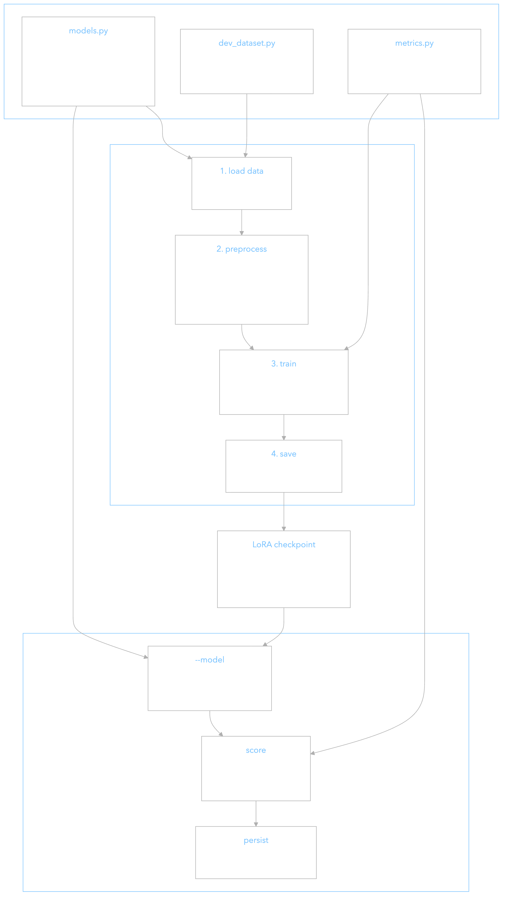
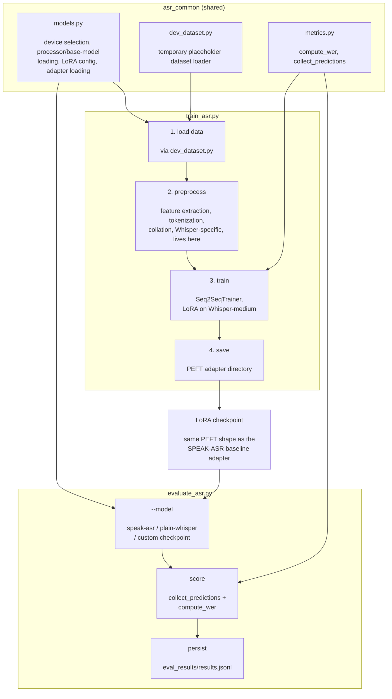

# Sinhala ASR: Fine-Tuning & Evaluation

LoRA fine-tuning of Whisper on Sinhala speech, plus the evaluation pipeline used to score it
(and any other candidate model) by Word Error Rate (WER).

This folder owns fine-tuning and evaluation only. Dataset cleaning, transcript normalization,
resampling decisions, filtering, and augmentation belong to a separate preprocessing pipeline
(being built against OpenSLR) that isn't finalized yet. See "Placeholder dataset" below.

For how this folder connects to the backend and to preprocessing, see
[`INTEGRATION_POINTS.md`](INTEGRATION_POINTS.md). For an independent review of this folder's
work against the project's SRS and Software Architecture Document, including open gaps, see
[`SRS_SAD_COMPLIANCE_REVIEW.md`](SRS_SAD_COMPLIANCE_REVIEW.md).

## Status

Evaluated existing prior work from the [SPEAK-ASR](https://huggingface.co/SPEAK-ASR)
HuggingFace org as a baseline before fine-tuning our own adapter:

- `SPEAK-ASR/whisper-medium-si-merged`: an undocumented merged checkpoint that produces garbage
  output on most inputs. Not usable.
- `SPEAK-ASR/whisper-si-exp-10-medium-all`: a LoRA adapter on `openai/whisper-medium`,
  documented eval WER 10.85%, eval loss 0.199. Verified independently: produces accurate
  transcriptions and matches the claimed WER on spot checks.

`train_asr.py` fine-tunes a new adapter of our own on top of the same base model.
`evaluate_asr.py` scores the SPEAK-ASR baseline, stock Whisper, or any locally-trained
checkpoint the same way, so numbers are directly comparable.

## Layout

- `asr_common/`: shared code used by both scripts.
  - `models.py`: device selection, Whisper processor/base-model loading, LoRA config, loading
    a LoRA adapter (baseline, checkpoint, or in-progress training run) for inference.
  - `metrics.py`: WER computation and the prediction-collection loop both scripts use, so a
    model's score can't drift between "checked during training" and "the standalone evaluator".
  - `dev_dataset.py`: **temporary** placeholder dataset loader, see below.
- `scripts/train_asr.py`: LoRA fine-tuning.
- `scripts/evaluate_asr.py`: WER evaluation.
- `checkpoints/`: local LoRA adapter output. Gitignored, since these are large binary artifacts.
- `eval_results/results.jsonl`: one JSON line per evaluation run, tracked in git.
- `diagrams/`: diagram source (`.mmd`) and rendered images, used by this README and by
  `INTEGRATION_POINTS.md`.
- `INTEGRATION_POINTS.md`: how this folder connects to the backend and to preprocessing.
- `SRS_SAD_COMPLIANCE_REVIEW.md`: independent review against the project's SRS/SAD.

## Code structure

How the two scripts share code, and where a checkpoint goes once it exists. (For how this
folder connects to the backend and preprocessing, see [`INTEGRATION_POINTS.md`](INTEGRATION_POINTS.md)
instead.)

<p align="center">
  <br>
  
  <br>
  <br>
</p>

<details>
<summary>Mermaid source</summary>



</details>

## Setup

Requires Python 3.11+, `ffmpeg` on PATH, and:

```
pip3 install -r model-development/requirements.txt
```

## Placeholder dataset

`asr_common/dev_dataset.py` currently loads `SPEAK-ASR/openslr-sinhala-asr` directly from the
HF Hub. It's the only place in this workflow that knows anything about that dataset's shape
(id, columns, splits). This stands in for the real preprocessing pipeline's output until it's
ready. When it lands, only `dev_dataset.py` needs to change: `train_asr.py` just expects a
`datasets` `Dataset`/`IterableDataset` with `audio` and `text` columns, whatever produces it.

## Running an evaluation

```
python3 model-development/scripts/evaluate_asr.py --model speak-asr --num-samples 20
python3 model-development/scripts/evaluate_asr.py --model plain-whisper --whisper-size medium --num-samples 20
python3 model-development/scripts/evaluate_asr.py --model custom --checkpoint model-development/checkpoints/<run> --num-samples 20
```

Every run appends a row (model, checkpoint, WER, sample count, git commit, timestamp) to
`eval_results/results.jsonl`. Pass `--no-persist` to skip logging a throwaway run.

## Fine-tuning

Real run (needs a GPU: Whisper-medium + LoRA on CPU/MPS is impractically slow for anything
beyond a smoke test):

```
python3 model-development/scripts/train_asr.py \
  --output-dir model-development/checkpoints/whisper-medium-si-lora --num-train-epochs 3
```

Local smoke test (proves the pipeline runs end to end, not that the resulting model is any
good, just 5 steps on a handful of samples):

```
python3 model-development/scripts/train_asr.py \
  --streaming --max-steps 5 --max-train-samples 20 --max-eval-samples 5 \
  --per-device-train-batch-size 1 --eval-steps 5 --save-steps 5 \
  --output-dir model-development/checkpoints/smoke-test
```

Then confirm the checkpoint round-trips through evaluation:

```
python3 model-development/scripts/evaluate_asr.py \
  --model custom --checkpoint model-development/checkpoints/smoke-test --num-samples 3
```

LoRA defaults (`--lora-r 32 --lora-alpha 64 --lora-dropout 0.05
--lora-target-modules q_proj,v_proj`) are a standard, clean starting point: the common
`alpha = 2r` heuristic. SPEAK-ASR's own published adapter config (`r=101, alpha=144,
dropout≈0.0885`, from their Hub `adapter_config.json`) is available if you want to try
replicating their exact setup instead. Pass those values explicitly; they aren't the default.

`--precision auto` resolves to `fp16` on CUDA and `fp32` on MPS/CPU. Whisper on MPS/CPU with
fp16 is a known source of unstable/NaN losses, so reduced precision is only allowed on CUDA.

## Models & data (not stored in this repo)

Model weights and datasets are downloaded automatically the first time you run a script. There
is nothing to manually download or place inside the repo. They're fetched by the
`transformers`/`huggingface_hub`/`whisper` libraries and cached outside the project folder:

| What | Source | Cached at |
|---|---|---|
| `openai/whisper-medium` (base model, both for the SPEAK-ASR baseline and our own fine-tuning) | [huggingface.co/openai/whisper-medium](https://huggingface.co/openai/whisper-medium) | `~/.cache/huggingface/hub/` |
| Plain Whisper sizes (`tiny`...`large-v3`, used by `--model plain-whisper`) | [openai/whisper](https://github.com/openai/whisper) | `~/.cache/whisper/` |
| SPEAK-ASR Sinhala LoRA adapter | [huggingface.co/SPEAK-ASR/whisper-si-exp-10-medium-all](https://huggingface.co/SPEAK-ASR/whisper-si-exp-10-medium-all) | `~/.cache/huggingface/hub/` |
| Placeholder dataset (see above) | [huggingface.co/datasets/SPEAK-ASR/openslr-sinhala-asr](https://huggingface.co/datasets/SPEAK-ASR/openslr-sinhala-asr) | `~/.cache/huggingface/hub/` |
| Locally fine-tuned adapters (this folder's `train_asr.py`) | produced locally, not downloaded | `model-development/checkpoints/<run>/` (in-repo, gitignored) |

`.gitignore` excludes `*.pt`/`*.safetensors`/`*.ckpt` and `model-development/checkpoints/` so
none of these get accidentally committed. If you need to free disk space, it's safe to delete
either cache folder. Everything re-downloads on next run.
